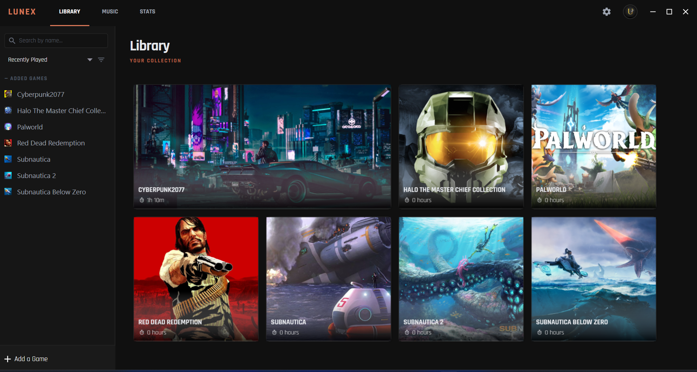
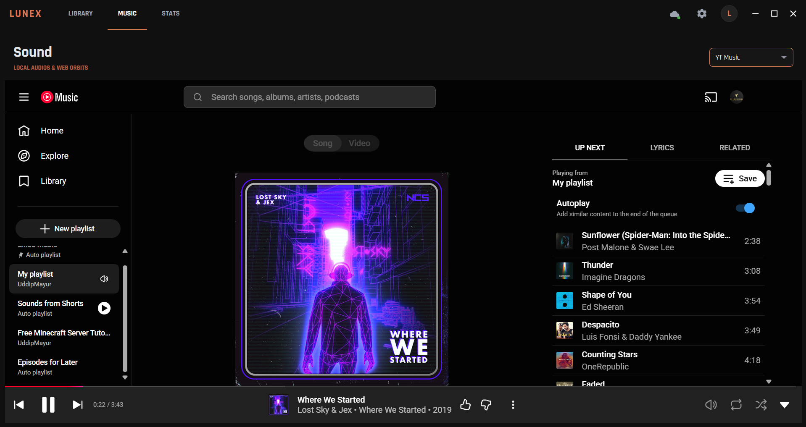
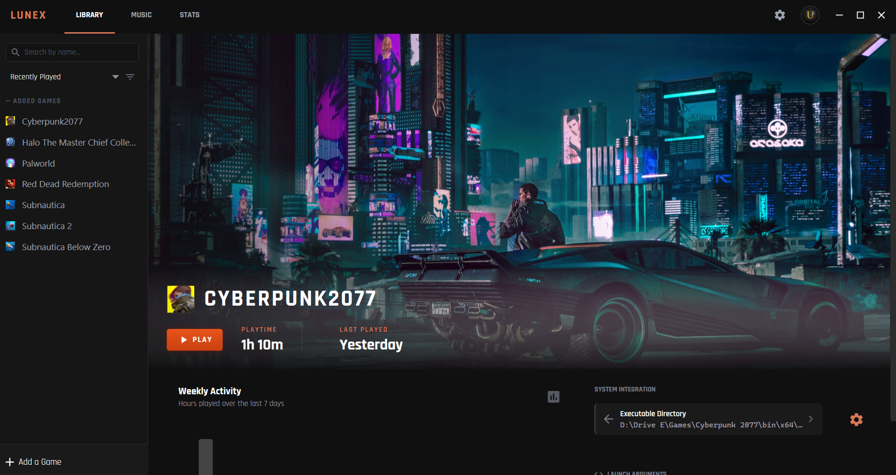

# Lunex

A personal game library hub and media dashboard for Windows. Lunex keeps your game collection, playtime stats, and music in one place — all wrapped in a dark, glassmorphic interface that actually feels good to use.



---

## What it does

- **Game library** — Add any game from any platform. Automatically fetches rich game metadata from the RAWG API. Set custom names, launch arguments, cover art, and icon. One click to launch.
- **Playtime tracking** — Every session is timed automatically. Tracks total hours, last played, and session history per game.
- **Built-in music view** — Chromium-powered web view that keeps playing music while you navigate to other parts of the app. Spotify, YouTube, whatever.
- **Cloud auth & sync** — Securely log in to back up your game library and statistics to the cloud for automatic synchronization across devices.
- **Background operation** — Can launch directly to the system tray on PC startup, and minimize itself to the tray automatically while a game is running.
- **Profile hub** — Customize your display name and profile details. Nothing fancy, just a central place for your info.
- **Background auto-updater** — Checks for updates silently on launch. Downloads the installer in the background. Prompts you when it's ready.
- **Single-instance enforcement** — Opening Lunex while it's already running just brings the existing window to the front instead of spawning a second process.

---

## Screenshots

| Library | Stats |
|---|---|
|  |  |

---

## Running locally

**Prerequisites:**
- [.NET 9.0 SDK](https://dotnet.microsoft.com/download/dotnet/9.0) (For devlopement only)
- Windows 10 or 11 (64-bit)
- Microsoft Edge WebView2 runtime (comes pre-installed on Windows 11; [download here](https://developer.microsoft.com/en-us/microsoft-edge/webview2/) for Windows 10)

**Clone and run:**

```bash
git clone https://github.com/uddipmayur/lunex.git
cd lunex
dotnet run
```
Lunex creates its data files automatically under `%APPDATA%\Lunex`.

> **Note:** Enter your own supabase creds in `UpdateService.cs` and `SupabaseService.cs` if you want to make your own build.

> **Note:** `dotnet run` builds and starts the debug build. For a proper self-contained release build, see the Packaging section below.

---

## How the updater works

On every startup, Lunex fires a background task that checks a Supabase table for the latest version. This happens off the UI thread so it never blocks or delays the window from opening.

Here's the flow:

1. Fetches the latest version entry from the database (version string + installer download URL).
2. Compares it against the current embedded version (`UpdateService.CurrentVersion`).
3. If there's a newer version, it checks `%TEMP%\LunexUpdates\` for an already-downloaded installer.
   - If a valid installer is already cached (correct PE headers, correct version, correct file size), it skips the download entirely and marks the update as ready.
   - Otherwise, it downloads the installer in the background with progress tracking.
4. Once downloaded, the app prompts the user. On confirmation, it launches the installer and exits cleanly.

If the app is already on the latest version, any stale installer files left in `%TEMP%\LunexUpdates\` are deleted automatically.

**DNS fallback:** Some ISPs block Supabase domains. The updater handles this by falling back to Google's DNS-over-HTTPS resolver (`8.8.8.8`) if a standard DNS lookup fails. This is handled transparently — users never see an error about it.

---

## How single-instance works

Lunex uses a named Win32 `Mutex` to detect if another instance is already running. If a duplicate launch is detected:

1. The new process signals the existing instance via a named `EventWaitHandle`.
2. The existing instance receives the signal and calls `ShowWindow()` to bring itself to the front.
3. The duplicate process shuts down immediately — no window ever appears.

This avoids the usual problem of multiple overlapping app windows when a user accidentally double-launches.

---

## Data storage

User data is managed locally in `%APPDATA%\Lunex` and optionally synced to the cloud via the built-in authentication system.

| File | Contents |
|---|---|
| `lunex_settings.json` | App settings (theme, launch behavior, etc.) |
| `lunex_games.json` | Your game library with metadata and playtime |
| `lunex_profile.json` | Profile name and display info |

These files are never tracked by Git.

---

## Packaging

To build a self-contained installer:

```powershell
dotnet publish -c Release -r win-x64 --self-contained true
```

This compiles a self-contained `win-x64` release build.

**Prerequisites for packaging:**
- .NET 9.0 SDK
- [Inno Setup 6](https://jrsoftware.org/isinfo.php)
- A valid code-signing certificate (PFX file — not included in the repo)

---

## Tech stack

| Layer | What's used |
|---|---|
| UI framework | WPF (Windows Presentation Foundation) |
| Forms interop | Windows Forms (for system tray and some dialogs) |
| Target runtime | .NET 9.0, self-contained `win-x64` |
| Web rendering | Microsoft Edge WebView2 (Chromium) |
| Update backend | Supabase (Postgres REST API) |

---

## Security notes

**Git exclusions** — `bin/`, `obj/`, `.vs/`, IDE setting files, and all `*.user` files are excluded via `.gitignore`. Build artifacts never end up in the repo.

**Local data** — All game libraries, profiles, and settings stay on-device in `%APPDATA%\Lunex`. Nothing user-specific is committed.

**API credentials** — Enter your own supabase creds in `UpdateService.cs` and `SupabaseService.cs` if you want to make your own build. Never commit private secrets.

---

## License

MIT License — Copyright (c) 2026 Nexus Realm
